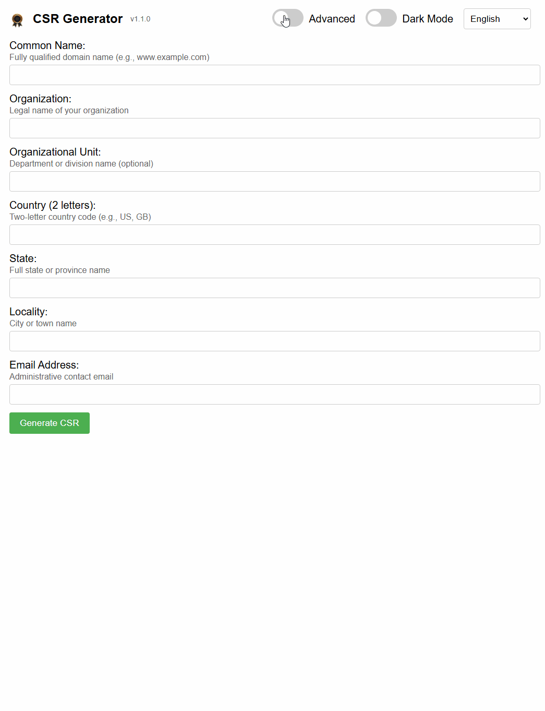
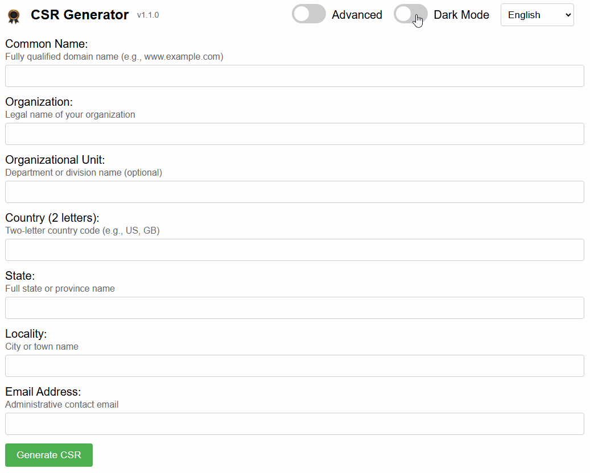

# Certificate Signing Request generator written in Go

## Requirements:

[Golang v1.23+](https://go.dev/doc/install)

## Usage:
`go run cmd/server/main.go` and navigate to [http://localhost:8080/](http://localhost:8080/)

## Screenshot advanced mode:

## Screenshot light/dark mode:
